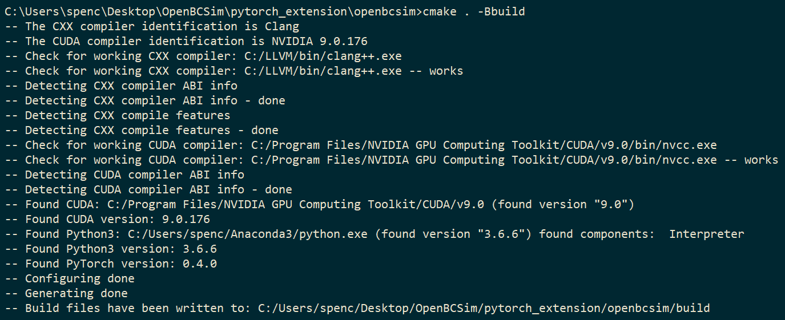
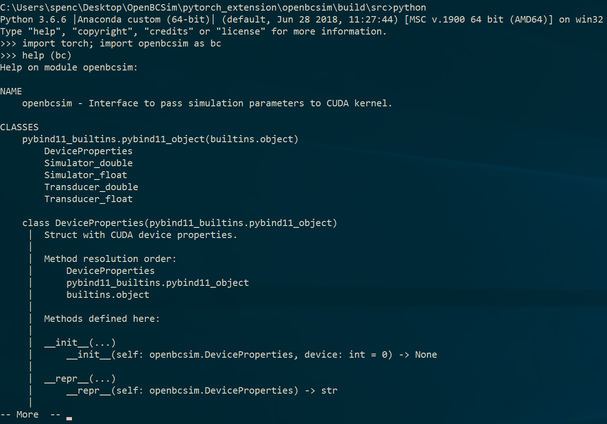

## Notes
- Only tested on Windows with Anaconda Python distribution.
  - `CMakeLists.txt` doesn't fully account for differences in other OSs.
- Does not depend on files outside this directory (i.e. no dependence on original OpenBCSim parent repository files).

## Requirements
- Windows 10 64-bit
- [LLVM 6.0.0](http://releases.llvm.org/download.html)
  - Clang (prebuilt binary is fine)
  - LLD (build from source if it doesn't come with the Clang download)
- [Anaconda](https://www.anaconda.com/download/) with Python 3.6
- [PyTorch](https://pytorch.org/) (≥ 0.4.0)
- [CUDA Toolkit](https://developer.nvidia.com/cuda-downloads) (≥ 8.0, match PyTorch version)
- [Visual Studio](https://visualstudio.microsoft.com/downloads/) (≥ 2015)

## Build Instructions
1. Change directory to source: `cd pytorch_extension/openbcsim`.
2. Make build directory: `mkdir build`.
3. Run CMake: `cmake . -Bbuild`. Fix any missing variables. These steps/checks could help:
   - Set `PyTorch_ROOT` (CMake cache variable)
   - Set `CUDA_PATH` (environment variable to help CMake find CUDA)
   - Set `MSVCRT_DIR` (Cmake cache variable, path to Visual C++ runtime libraries)
    - For me, clang found `msvcrt.lib` without my needing to set this.
   - Make sure Python executable is in `PATH` if CMake can't find it.
   - Make sure that `%CUDA_PATH%/lib/x64/cudart.lib` exists (path to CUDA runtime library).
   - Make sure `%MSVCRT_DIR%/msvcrt.lib` exists.

   Should see something like this:
   
4. Build binaries: `cmake --build build`.
5. Run tests: `ninja -Cbuild test` (or `cd build && ctest`).
   - If get test failed with [`Exit code 0xc0000135`](https://msdn.microsoft.com/en-us/library/cc704588.aspx) it means a runtime library is missing.
   Check the script outputted to `scripts/SET_RUNTIME_PATHS.(bat|sh)` by CMake to make sure those paths exist.
6. Use the extension in Python: `import torch; import openbcsim`.
   - `import torch` must come first or there will be a "missing DLL" error.
   - Add path containing `openbcsim.<version>.pyd` (i.e. `pytorch_extension/openbcsim/build/src`) to `PYTHONPATH` environment variable for Python to find it.
     - Or keep `openbcsim.<version>.pyd` in the same directory Python is started in.
       - Use the `install` build target to put all the needed files in one place:
       `ninja -Cbuild install`.

   Should see something like this:
   